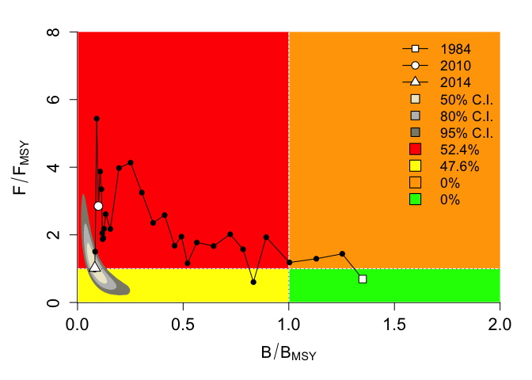

<!-- README.md is generated from README.Rmd. Please edit that file -->

# portedcmsy

A minimal and functional port of
[cmsy](https://github.com/SISTA16/cmsy). Only the catch-only version of
CMSY is supported (not the BSM version). The only difference between the
original CMSY and this ported version is that the internal Schaefer
model has been replaced with a c++ version to speed things up.

**this package should not be used for assessment or practical use in any
fishery. it is purely for demonstration purposes**

``` r

# setup -------------------------------------------------------------------
library(tidyverse)
#> ── Attaching packages ──────────────────────────────── tidyverse 1.3.0 ──
#> ✓ ggplot2 3.3.2     ✓ purrr   0.3.4
#> ✓ tibble  3.0.3     ✓ dplyr   1.0.1
#> ✓ tidyr   1.1.1     ✓ stringr 1.4.0
#> ✓ readr   1.3.1     ✓ forcats 0.5.0
#> ── Conflicts ─────────────────────────────────── tidyverse_conflicts() ──
#> x dplyr::filter() masks stats::filter()
#> x dplyr::lag()    masks stats::lag()

library(R2jags)  # Interface with JAGS
#> Loading required package: rjags
#> Loading required package: coda
#> Linked to JAGS 4.3.0
#> Loaded modules: basemod,bugs
#> 
#> Attaching package: 'R2jags'
#> The following object is masked from 'package:coda':
#> 
#>     traceplot

library(coda)

library(parallel)

library(foreach)
#> 
#> Attaching package: 'foreach'
#> The following objects are masked from 'package:purrr':
#> 
#>     accumulate, when

library(doParallel)
#> Loading required package: iterators

library(gplots)
#> 
#> Attaching package: 'gplots'
#> The following object is masked from 'package:stats':
#> 
#>     lowess

library(mvtnorm)

library(snpar)

library(knitr)

library(tinytex)

library(here)
#> here() starts at /Users/danovan/packages/portedcmsy

library(portedcmsy)

FullSchaefer <-
  F    # initialize variable; automatically set to TRUE if enough abundance data are available

n.chains     <- 4

ncores_for_computation <-
  8 # cores to be used for parallel processing of CMSY

cl  <- makeCluster(ncores_for_computation)

registerDoParallel(cl, cores = ncores_for_computation)

catch_file  <-
  "Stocks_Catch_EU_1.csv" #  name of file containing "Stock", "yr", "ct", and optional "bt"
id_file     <-
  "Stocks_ID_EU_8.csv" #  name of file containing stock-specific info and settings for the analysis
outfile     <-
  paste("Out_", format(Sys.Date(), format = "%B%d%Y_"), id_file, sep = "") # default name for output file

# stock_name <- "smn-dp"
stock_name <- "fle-2732" #
stock_name <- "cod-rock"

cdat <-
  read.csv(
    here("cmsy", catch_file),
    header = T,
    dec = ".",
    stringsAsFactors = FALSE
  ) %>%
  janitor::clean_names()

cinfo <-
  read.csv(
    here("cmsy", id_file),
    header = T,
    dec = ".",
    stringsAsFactors = FALSE
  ) %>%
  janitor::clean_names()

cdat <- cdat %>%
  filter(stock == stock_name)

cinfo <- cinfo %>%
  filter(stock == stock_name)

set.seed(42)
a <- Sys.time()
ported_cmsy <- portedcmsy::funct_cmsy(catches = cdat$ct / 1000,
                          catch_years = cdat$yr,
                          stock = cinfo$stock,
                          common_name = cinfo$name,
                          scientific_name = cinfo$scientific_name,
                          r.low = cinfo$r_low,
                          r.hi = cinfo$r_hi,
                          res = cinfo$resilience,
                          stb.low = cinfo$stb_low,
                          stb.hi = cinfo$stb_hi,
                          int.yr = cinfo$int_yr,
                          intb.low = cinfo$intb_low,
                          intb.hi = cinfo$intb_hi,
                          endb.low = cinfo$endb_low,
                          endb.hi = cinfo$endb_hi,
                          start.yr = min(cdat$yr),
                          end.yr = cinfo$end_year,
                          cores = 12)
#> startbio= 0.5 0.85 expert , intbio= 2010 0.01 0.4 default , endbio= 0.01 0.1 default 
#> First Monte Carlo filtering of r-k space with  20000  points...
#> 
#> Found  188  viable trajectories for 184  r-k pairs
#> Repeating analysis with more points...
#> Attempt  1  of  3  with  20000  additional points... 
#> 
#> Found altogether 528  viable trajectories for 514  r-k pairs
port_time <- Sys.time() - a

write_rds(ported_cmsy, "ported_cmsy.rds")
# rm(SchaeferParallelSearch)
a <- Sys.time()

source(here("cmsy","functional-cmsy-2019-9f.R"))
#> Loading required package: xml2
#> 
#> Attaching package: 'rvest'
#> The following object is masked from 'package:purrr':
#> 
#>     pluck
#> The following object is masked from 'package:readr':
#> 
#>     guess_encoding
#> 
#> Attaching package: 'glue'
#> The following object is masked from 'package:dplyr':
#> 
#>     collapse
#> Files Stocks_Catch_EU_1.csv , Stocks_ID_EU_8.csv read successfully 
#> Processing cod-rock , Gadus morhua 
#> startbio= 0.5 0.85 expert , intbio= 2010 0.01 0.4 default , endbio= 0.01 0.1 default
#> First Monte Carlo filtering of r-k space with  20000  points...
#> 
#> Found  172  viable trajectories for 167  r-k pairs
#> Repeating analysis with more points...
#> Attempt  1  of  3  with  20000  additional points... 
#> 
#> Found altogether 622  viable trajectories for 600  r-k pairs
```



``` r

cmsy_time <- Sys.time() - a

message(glue::glue("ported version cmsy runs {round(as.numeric(port_time)/as.numeric(cmsy_time))} times faster than official cmsy"))
#> ported version cmsy runs 9 times faster than official cmsy

sista_output <-  output %>%
  mutate(b_bmsy = bt / bmsy) %>%
  select(ct, b_bmsy, f_fmsy, year) %>%
  mutate(year = as.numeric(year) - 1 + 1950) %>%
  mutate(code = "SISTA16 CMSY") %>%
  filter(year %in% ported_cmsy$year)


ported_output <- ported_cmsy %>%
  mutate(b_bmsy = bt / bmsy) %>%
  select(ct, b_bmsy, f_fmsy, year) %>%
  mutate(code = "ported CMSY")

compare_outputs <- sista_output %>%
  bind_rows(ported_output) %>%
  group_by(code) %>%
  pivot_longer(c(-code,-year), names_to = "variable", values_to = "value")

compare_outputs %>%
  # filter(year >= 2000) %>%
  ggplot(aes(year, value, color = code, linetype = code)) +
  geom_line() +
  facet_wrap(~variable, scales = "free_y") +
  scale_y_continuous(limits = c(0,NA)) +
  scale_color_discrete(labels = c("Ported CMSY", "Official CMSY")) +
  scale_linetype(labels = c("Ported CMSY", "Official CMSY"))
```


